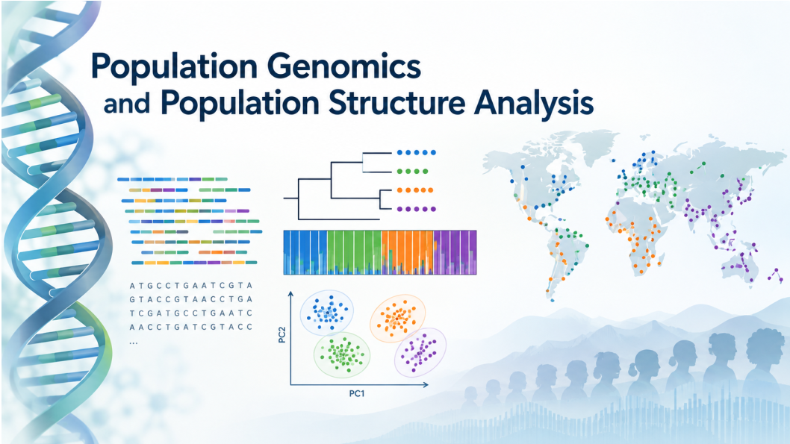

# Population Genomics and Structure Analysis

## Instructor

- Dr. Nikolay Oskolkov, Group Leader (PI) at NIRI, Riga, Latvia

## Course overview
The study of genetic variation within and between populations using next-generation sequencing (NGS) data has become a cornerstone of modern population genomics, with wide-ranging applications in evolutionary biology, human genetics, conservation, and medical research. However, the analysis of low-coverage NGS data poses significant computational and statistical challenges, particularly when moving from raw sequencing reads to biologically meaningful inferences about population structure and demographic history. In this course, we will explore the key challenges and analytical methods in population genomics, focusing on a comprehensive understanding and practical implementation of the variant calling and population structure workflow spanning alignment, genotype likelihood-based inference with GATK and ANGSD, dimensionality reduction with PCA, tSNE and UMAP, admixture analysis, and population differentiation through Fst, F2, F3, and D-statistics of introgression.

## Target audience and assumed background
We assume some basic awareness of UNIX environment, as well as at least beginner level of R and / or Python programming.

## Learning outcomes
By completing this course, you will:

- Understand the fundamentals of next-generation sequencing data and genetic variation in natural populations
- Have an overview of bioinformatic tools and best practices for variant calling from low-coverage NGS data
- Be able to perform alignment, genotype likelihood estimation, and variant calling with GATK and ANGSD on your own samples
- Know the key challenges, approaches, and solutions in population structure and demographic inference
- Be able to carry out PCA, admixture analysis, and Fst, F2, F3, and D-statistic computations to answer your specific research question
- Be able to interpret population structure results and choose the right statistical framework for your study system 

---

# Schedule

## Before the course

| Time   | Activity                                                                                           |Link                                                                                                            |
|--------|----------------------------------------------------------------------------------------------------|------------------------------------------------------------------------------------------------------------------------------------------|
| ~ 1 h  | Recorded talk: AaRCademy workshop: aDNA data processing with Nikolay Oskolkov                      | [Video](https://www.youtube.com/watch?v=-nWoq6NTBd0&t=2121s)                                                                                           |
| ~ 2 h  | DNAHarvester: a pipeline for analysis of highly degraded DNA from low-covarege samples             | [PDF](https://github.com/NikolayOskolkov/PopGen_PopStructure/blob/main/articles/2026.04.20.719564v2.full.pdf)                                                                                 |
| ~ 1 h  | Useful reading: how the curse of dimensionality complicates genomics analysis                      | [Blog](https://medium.com/data-science/genomics-new-clothes-6301ab9798a7?sk=db5db53c7f968add8a4b9a82579bf56d)                                                                          |
| ~ 1 h  | In case needed: Recap on basic Unix commands                                                       | [Lab](https://github.com/NikolayOskolkov/PopGen_PopStructure/blob/main/practicals/command-line-basics.md)                                                                                                    |

## Day 1: 3 pm - 9 pm Swedish time

| Time           | Activity                                                                                   |Link                                                                                                            |
|----------------|--------------------------------------------------------------------------------------------|------------------------------------------------------------------------------------------------------------------------------------------|
| 15.00 - 15.30  | Course outline and practical information, introductions of participants                    | [Slides](https://github.com/NikolayOskolkov/PopGen_PopStructure/blob/main/slides/Day1/course_outline.pdf)                                                                                           |
| 15.30 - 16.30  | Challenges of high-dimensional genomics data analysis                                      | [Slides](https://github.com/NikolayOskolkov/PopGen_PopStructure/blob/main/slides/Day1/ChallengesGenomics.pdf)                                                                                       |
| 16.30 - 17.30  | Introduction to Next Generation Sequencing (NGS) data, BWA alignment and GATK workflow     | [Slides](https://github.com/NikolayOskolkov/PopGen_PopStructure/blob/main/slides/Day1/NGS_workflow_GATK.pdf)                                                                                        |
| 17.30 - 18.30  | Break                                                                                      |                                                                                                                |
| 18.30 - 19.00  | Probabilistic variant calling from low-coverage genomics data with ANGSD                   | [Slides](https://github.com/NikolayOskolkov/PopGen_PopStructure/blob/main/slides/Day1/ANGSD.pdf)                                                                                                    |
| 19.00 - 20.30  | Practical: quality control, adapter removal and alignment with BWA MEM                     | [Lab](https://github.com/NikolayOskolkov/PopGen_PopStructure/blob/main/practicals/Day1/QC_Alignment_Colab.ipynb)                                                                                     |
| 19.00 - 20.30  | Practical: variant calling from low-coverage genomics data with ANGSD                      | [Lab](https://html-preview.github.io/?url=https://github.com/NikolayOskolkov/PopGen_PopStructure/blob/main/practicals/Day1/ANGSD_Lab_GoogleColab.html)                                                                   |
| 20.30 - 21.00  | Questions and discussion                                                                   |

## Day 2: 3 pm - 9 pm Swedish time

| Time           | Activity                                                                                   |Link                                                                                                            |
|----------------|--------------------------------------------------------------------------------------------|------------------------------------------------------------------------------------------------------------------------------------------|
| 15.00 - 16.00  | Bonus material: introduction to imputation and genetic imputation with IMPUTE2             | [Slides](https://github.com/NikolayOskolkov/PopGen_PopStructure/blob/main/slides/Day2/imputation.pdf)                                                                                               |
| 15.00 - 16.00  | Principal Components Analysis (PCA) for population genomics applications                   | [Slides](https://github.com/NikolayOskolkov/PopGen_PopStructure/blob/main/slides/Day2/PCA_PopGen.pdf)                                                                                               |
| 16.00 - 17.30  | Nonlinear dimensionality reduction with tSNE and UMAP for population genomics applications | [Slides](https://github.com/NikolayOskolkov/PopGen_PopStructure/blob/main/slides/Day2/DimReduct_PopGen.pdf)                                                                                         |
| 17.30 - 18.30  | Break                                                                                      |                                                                                                                |
| 18.30 - 19.30  | Practical: coding PCA and Multi-Dimensional Scaling (MDS) from scratch                     | [Lab](https://html-preview.github.io/?url=https://github.com/NikolayOskolkov/PopGen_PopStructure/blob/main/practicals/Day2/pca_mds_toy_example.html)                                                                     |
| 18.30 - 19.30  | Practical: practicing PCA, MDS, tSNE and UMAP                                              | [Lab](https://html-preview.github.io/?url=https://github.com/NikolayOskolkov/PopGen_PopStructure/blob/main/practicals/Day2/Dimension_Reduction_tutorial.html)                                                            |
| 19.30 - 20.30  | Practical: horseshoue effect in PCA, coding from scratch and exploring block structure     | [Lab](https://html-preview.github.io/?url=https://github.com/NikolayOskolkov/PopGen_PopStructure/blob/main/practicals/Day2/WhyPCALooksTriangular.html)                                                                   |
| 20.30 - 21.00  | Questions and discussion                                                                   |

## Day 3: 3 pm - 9 pm Swedish time

| Time           | Activity                                                                                   |Link                                                                                                            |
|----------------|--------------------------------------------------------------------------------------------|------------------------------------------------------------------------------------------------------------------------------------------|
| 15.00 - 16.00  | Introduction to clustering algorithms: hierarchical and partition clustering               | [Slides](https://github.com/NikolayOskolkov/PopGen_PopStructure/blob/main/slides/Day3/IntroClustering.pdf)                                                                                          |
| 16.00 - 17.30  | Phylogenetic analysis: genetic and evolutionary distance, phylogenetic tree construction   | [Slides](https://github.com/NikolayOskolkov/PopGen_PopStructure/blob/main/slides/Day3/PhylogeneticAnalysis.pdf)                                                                                     |
| 17.30 - 18.30  | Break                                                                                      |                                                                                                                |
| 18.30 - 19.30  | Admixture analysis and admixture inference from low-coverage data with NGSadmix            | [Slides](https://github.com/NikolayOskolkov/PopGen_PopStructure/blob/main/slides/Day3/Admixture.pdf)                                                                                                |
| 19.30 - 20.30  | Practical: admixture inference from low-coverage data with NGSadmix                        | [Lab](https://html-preview.github.io/?url=https://github.com/NikolayOskolkov/PopGen_PopStructure/blob/main/practicals/Day1/ANGSD_Lab_GoogleColab.html)                                                                   |
| 19.30 - 20.30  | Practical: practicing hierarchical, particioning and density-based clustering              | [Lab](https://html-preview.github.io/?url=https://github.com/NikolayOskolkov/PopGen_PopStructure/blob/main/practicals/Day3/Clustering_Lab.html)                                                                          |
| 19.30 - 20.30  | Practical: practicing Gaussian Mixture Model (GMM) underlying STRUCTURE software           | [Lab](https://html-preview.github.io/?url=https://github.com/NikolayOskolkov/PopGen_PopStructure/blob/main/practicals/Day3/GMM_FromScratch.html)                                                                         |
| 20.30 - 21.00  | Questions and discussion                                                                   |

## Day 4: 3 pm - 9 pm Swedish time

| Time           | Activity                                                                                   |Link                                                                                                            |
|----------------|--------------------------------------------------------------------------------------------|------------------------------------------------------------------------------------------------------------------------------------------|
| 15.00 - 16.00  | Introduction to selection and drift of allele frequencies: Wright-Fisher model             | [Slides](https://github.com/NikolayOskolkov/PopGen_PopStructure/blob/main/slides/Day4/selection.pdf)                                                                                                |
| 16.00 - 17.30  | F-statistics and population history inference: computing Fst, F2, F3 on AADR dataset       | [Slides](https://github.com/NikolayOskolkov/PopGen_PopStructure/blob/main/slides/Day4/F_statistics.pdf)                                                                                             |
| 17.30 - 18.30  | Break                                                                                      |                                                                                                                |
| 18.30 - 20.30  | Practical: computation of Fst from low-coverage data within ANGSD workflow                 | [Lab](https://html-preview.github.io/?url=https://github.com/NikolayOskolkov/PopGen_PopStructure/blob/main/practicals/Day1/ANGSD_Lab_GoogleColab.html)                                                                   |
| 20.30 - 21.00  | Questions and discussion                                                                   |

## Day 5: 3 pm - 9 pm Swedish time

| Time           | Activity                                                                                   |Link                                                                                                            |
|----------------|--------------------------------------------------------------------------------------------|------------------------------------------------------------------------------------------------------------------------------------------|
| 15.00 - 17.30  | Introgression analysis with D-statistic and applications to ancient DNA                    | [Slides](https://github.com/NikolayOskolkov/PopGen_PopStructure/blob/main/slides/Day5/Dstat.pdf)                                                                                                |
| 17.30 - 18.30  | Break                                                                                      |                                                                                                                |
| 18.30 - 20.30  | Practical: computation of D-statistic on Nenderthal and modern human genomics data         | [Lab](https://html-preview.github.io/?url=https://github.com/NikolayOskolkov/PopGen_PopStructure/blob/main/practicals/Day1/ANGSD_Lab_GoogleColab.html)                                                                   |
| 20.30 - 21.00  | Questions and discussion                                                                   |

